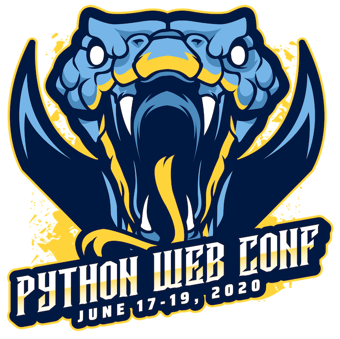
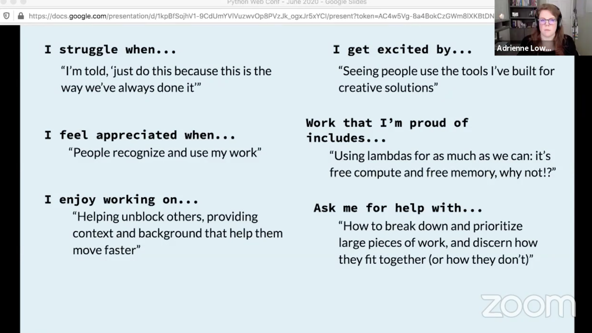

# Python Web Conference 2020

Notes & stuff for tech team pres on the conference to Bambora

Categories:

- Conference overview (~5 mins)
  - Multi-track
  - Tutorials on 1st day, day-long talks on day 2 & 3
  - Entirely virtual
- Tools/libraries/techniques from talks (~10 mins)
  - Sqlalchemy
  - WebTest
  - Fastapi with Pydantic <https://fastapi.tiangolo.com/>
    - With Django? <https://www.stavros.io/posts/fastapi-with-django/>
  - Secure.py <https://secure.readthedocs.io/en/latest/>
  - Pyup.io, Safety, Dependabot
  - Skulpt <https://skulpt.org/>, Brython <https://brython.info/>, and Pyodide <https://github.com/iodide-project/pyodide>
  - Nornir <https://nornir.readthedocs.io/en/latest/>
- General web stuff (~3 mins)
  - Openapi
  - JSONSchema <http://json-schema.org/>
  - OpenTelemetry <https://opentelemetry.io/>
  - Amazon EventBridge - ESB for serverless?
- Magic (~1 mins)
  - Anvil
  - Divio
- Cautionary Tales/Call to action/Inspirational talks
  - Machine Learning & Overselling
  - Ethics in Tech
  - Zen Of Python For Great Teams

- Sharing experiences as a theme (~5 mins)
  - 10 Tips For Running in Prod
    - Practical lessons/takeways from the trenches
  - Fireside Chat with Carl from Instagram
    - single mainline branch
    - true continuous deployment (as soon as something is approved in a PR and
      the button clicked to merge it, it’s in prod about 30 minutes later)
    - ballpark 100,000 (!!!!) automated tests
    - deployments are rolled out incrementally (3% of servers at first, then
      automated monitoring, and if everything looks cool it continues to roll
      out to other servers in the prod fleet)
    - extensive monitoring of all environments that’s automated so as an example
      if a change goes sideways it’s automatically rolled back and a task is
      automatically filed for the developer who introduced that change to
      investigate
    - They use Mercurial because _they need to hack on the VCS system itself to
      meet their needs_
