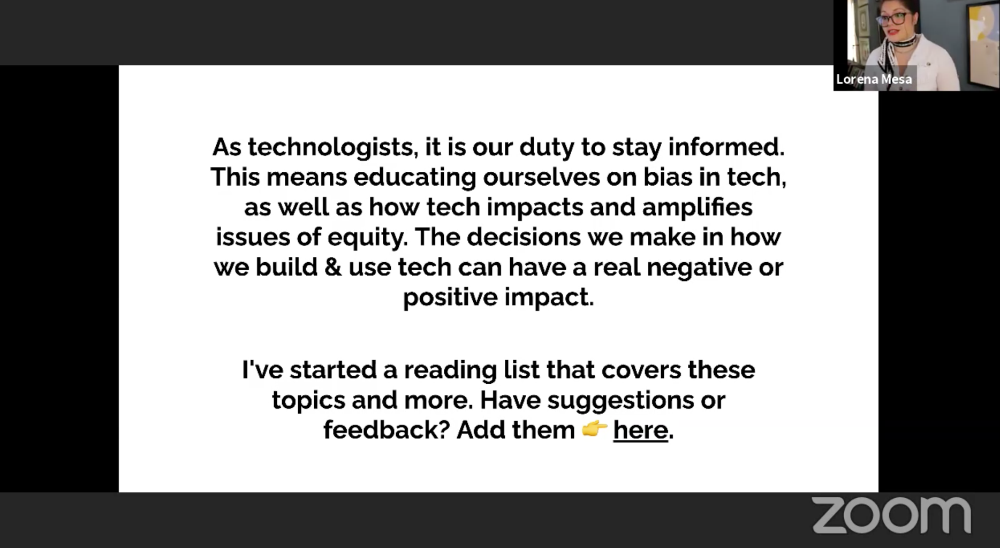

# Why I talk about ethics when I talk about technology

<https://github.com/lorenanicole>

In her talk, Lorena will be speaking on the ethical questions and quandaries
that she has grappled with during her career working with data in several
different organizations. She will talk about the lessons that she has learned
and how she now thinks about her work and the principles that guide it.

---

<bit.ly/whyethics-lmesa>

Predictive Policing idea in Chicago.

Weapons of Math Destruction by Cathy O'Neil
Algorithms of by Opression Safiya Umoja Noble
Chaos Monkeys by Antonio Garcia Martinez

<https://github.com/Data4Democracy/ethics-resources>

